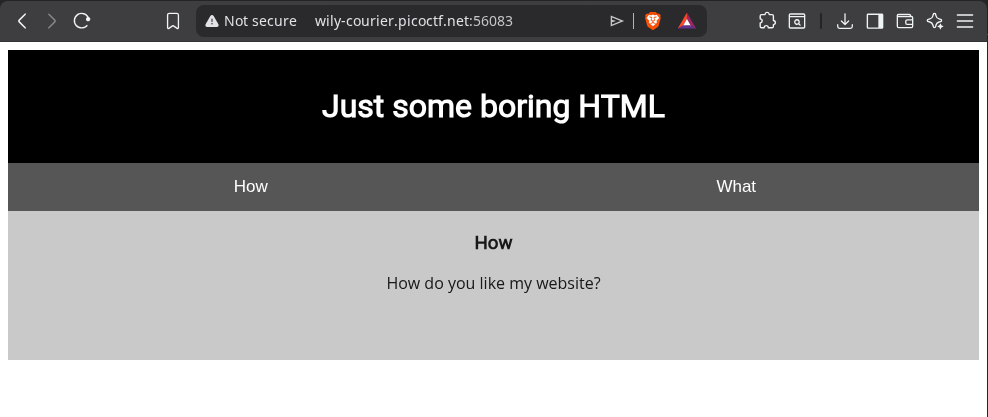
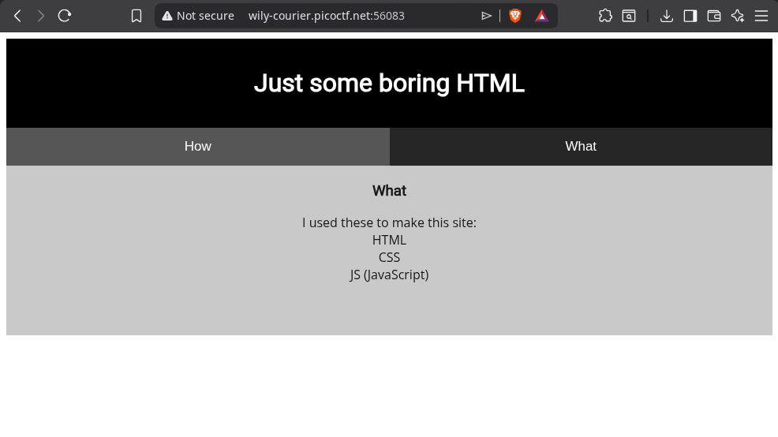
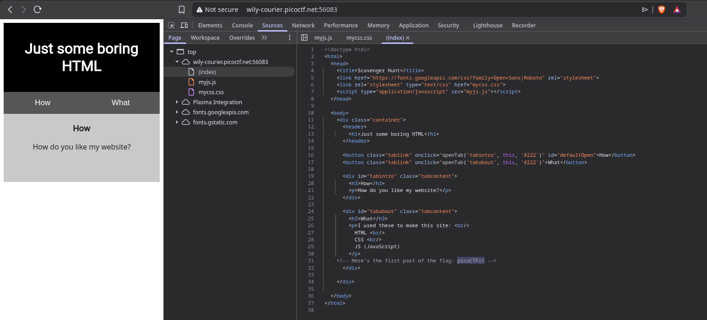
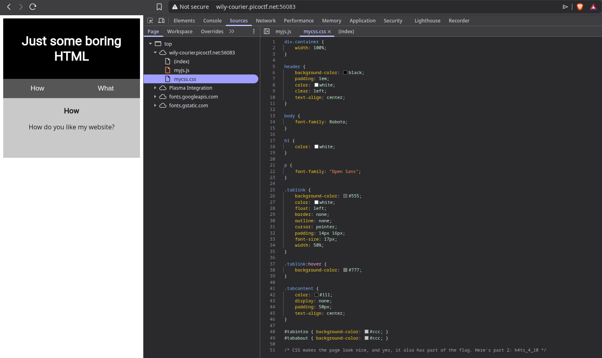
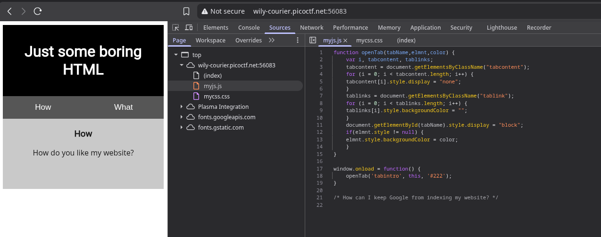
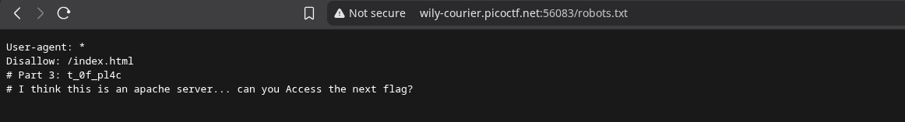
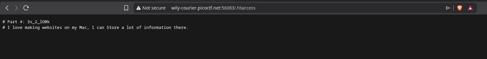
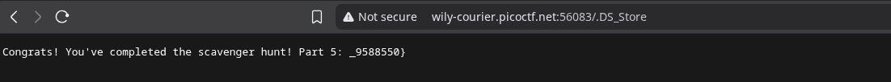

Hint 1: You should have enough hints to find the files, don't run a brute forcer.





Here's the first part of the flag: picoCTF{t 




/* CSS makes the page look nice, and yes, it also has part of the flag. Here's part 2: h4ts_4_l0 */




robots.txt karne ka simple ekdum



Part 3: t_0f_pl4c
I think this is an apache server... can you Access the next flag?

ayeeeeeee...we now have the complete flag- 
WHAT NOOOOOOO. MORE??? SIGH

this is what we have right now
picoCTF{th4ts_4_l0t_0f_pl4c



Part 4: 3s_2_lO0k
I love making websites on my Mac, I can Store a lot of information there.

so after googling a bit, found out apache server configuration and settings are stored in .htaccess file


The hint says: "I love making websites on my Mac, I can Store a lot of information there."
Key words: Mac + Store — that's pointing to .DS_Store!
.DS_Store is a hidden metadata file that macOS automatically creates in every folder. Developers accidentally upload them all the time, which can leak director
found this info on google too


Congrats! You've completed the scavenger hunt! Part 5: _9588550}

### Final Flag: 
```
picoCTF{th4ts_4_l0t_0f_pl4c3s_2_lO0k_9588550}
```
